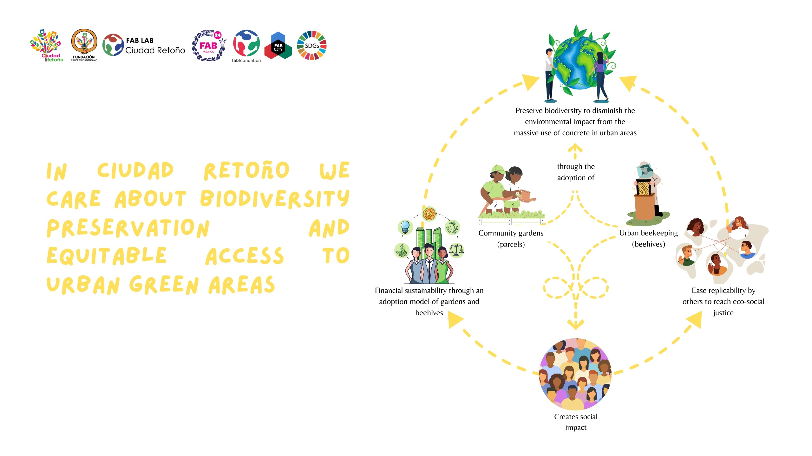

# Context

We are located in the municipality of La Paz, in the State of Mexico, one of the municipalities with the lowest indicators of social development and very high levels of violence and insecurity, which constitute risk factors that weaken the integral development of the people in the community. It has a territorial extension of 26.71 Km2 and has only 22 green areas, 9 of which are in optimal condition and the rest in regular and critical condition. It is worth noting that none of these areas is a friendly space for biodiversity conservation.

We have 4 beehives, which produced only 38Kg of honey in one year. A rule of thumb would be that a healthy hive can produce about 36Kg. Why are we having so low results? Lack of food for the bees, which means lack of flowers to feed from.

A beehive needs about 4M flowers! We are way behind that number in Ciudad Retoño and surrounding areas. Reasons? Two:

1. Lack of pollinator gardens 🌼
2. Lack of water to sustain them ♒

Looking at both the Ciudad Retoño hub and the surrounding neighborhoods we see a common element: cement. And more specifically, cement not serving any purpose but covering soil, as if we humans felt dirty getting in contact with it.

So we decided to work on removing concrete and planting community gardens that could also host beehives, bug hotels, and other ways of sustaining live and biodiversity.

### Check our proposal:

&#x20;

<figure><figcaption></figcaption></figure>

### Facts about cement and how it is directly related to the problem we are tackling

Cement cause the impermeabilization of the soil, that is, the loss of its capacity to infiltrate and retain water. This can cause problems of flooding, drought, desertification and contamination of surface and groundwater.

Additionally, it has been demonstrated that the excessive use of concrete in urban areas not only have a negative impact on environmental areas such as loss of biodiversity, heat island effect, and scarcity of water, cement also directly affects human beings through the development of chronic diseases and emotional alterations.

The impact we want to generate is based on the following:

* Preserve biodiversity through the implementation of pollinator plots (garden and beehives) in urban areas.
* Create alternatives to the problems related to the excessive use of concrete.
* Adapt and conserve pollinator gardens to make them scalable, playful and affordable for the community.
* Empower communities through the linkage with key actors that join in the preservation, education and care of nature, such as: Organizations, Educational Centers, Companies and local, national and international Communities.

We developed a model where our main objective is the preservation of biodiversity and the reduction of the negative impact of the excessive use of cement in urban areas through the installation of garden plots and beehives monitored with technological sensors and inviting the community to participate in the adoption of them.

We worked on a business model that allows the foundation to continue developing actions around environmental education and integral development of the community.

Additionally, as makers and open source believes, we are documenting the process and knowledge resources to help you replicate and adapt this solution to your own context.

On the next pages, you will access the resources and documentation we've gone through on our journey. We hope with love that can also be helpful for your community 🐝🌻
