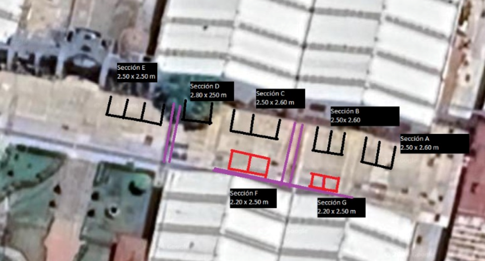

# Phase 1: Nature's comeback

1. Taking out concrete from 86m2 (the areas marked below). These were chosen as the feasible areas to test for the pilot. See image 1 below.\
   Cost: $30,232.44 MXN (1,595.08 USD)

<figure><figcaption>
Image 1. Feasible areas to replace concrete for community gardens
</figcaption></figure>

2. Preparing the soil and planting community gardens.\
   Cost: $39,999.46 MXN (2,110.40 USD)
3. Preserve the gardens for the next six months.\
   Cost: $9,000.00 MXN (474.85 USD)
4. Devices with sensors, LoRa Gateway, Fees.\
   Cost: $16,963.38 MXN (895 USD)

**Total cost: $96,194.33 MXN (5,075.28 USD)**

One thing to note is that we could get allies to adopt at the cost of launch since phase 1, meaning a potential income of $62,148.29 MXN (3,107.41 USD) for six months of subscription.
