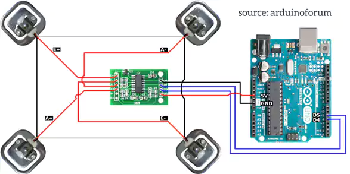
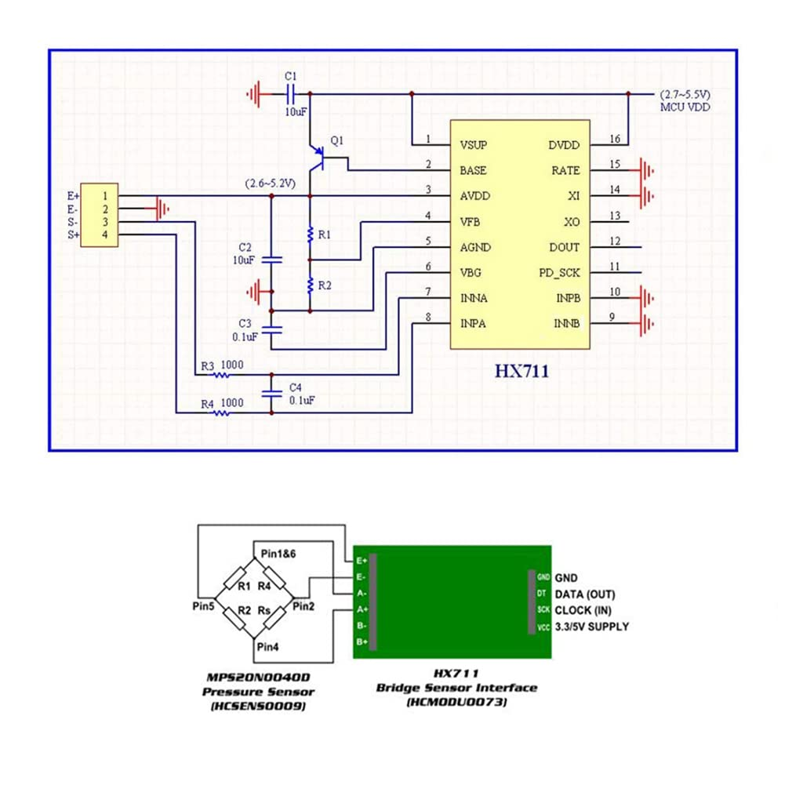

# Smart Beehive

In recent years, the integration of technology into beekeeping has given rise to smart beehives, transforming how beekeepers manage their colonies and ensuring the health and productivity of honeybees. These innovative hives, equipped with sensors and connectivity features, provide real-time insights into hive conditions, empower data-driven decision-making, and support sustainable beekeeping practices. Let's explore how smart beehives are reshaping the landscape of modern beekeeping.

## The Rise of Smart Beehives

Smart beehives represent a leap forward in hive management, leveraging advancements in sensor technology, the Internet of Things (IoT), and data analytics. These hives are equipped with various sensors that monitor critical parameters such as:

### Weight

Monitoring hive weight gives beekeepers an indication of the start and stop of nectar flow, alerting them to the need to feed (when weight is low) and to harvest honey (when weight is high). Comparing weight across hives gives beekeepers a sense of the relative productivity of each colony. A dramatic drop in weight can suggest that the colony has swarmed, or the hive has been knocked over by animals.

### Temperature

Monitoring hive temperature can alert beekeepers to dangerous conditions: excessive heat indicating the hive should be moved to a shady spot or ventilated; unusually low heat indicating the hive should be insulated or protected from cold winds.

### Humidity

While honey production produces a humid environment in hives, excessive humidity, especially in the winter, can be a danger to colonies. Monitoring humidity levels can let beekeepers know that moisture build-up is occurring, indicating a need for better ventilation and water removal.

### Acoustics

Acoustic monitoring within hives can alert beekeepers to a number of dangerous situations: specific changes in sound patterns can indicate the loss of a queen, swarming tendency, disease, or hive raiding.

### Bee count

Counting the number of bees entering and leaving a hive can give beekeepers an indication of the size and health of colonies. For commercial beekeepers this can indicate nectar flow, and the need to relocate hives to more productive areas.

## Benefits of Smart Beehives

### Remote Monitoring and Management

Perhaps the most significant advantage of smart beehives is the ability to monitor hive conditions remotely. Beekeepers can access real-time data via mobile apps or web interfaces, eliminating the need for frequent physical inspections that can disrupt bees and disturb the hive environment. This remote monitoring capability allows beekeepers to intervene promptly in case of emergencies, such as hive disturbances or adverse weather conditions.

### Early Detection of Issues

Smart beehives facilitate early detection of potential problems such as pest infestations (e.g., Varroa mites), diseases (e.g., foulbrood), or environmental stressors (e.g., pesticide exposure). By alerting beekeepers to these issues early on, smart hives enable timely intervention and treatment, thereby reducing colony losses and promoting bee health.

### Data-Driven Insights

The data collected from smart hives enable beekeepers to make informed decisions about hive management practices, honey harvesting schedules, and beekeeping strategies. Analyzing trends and patterns in hive metrics can reveal insights into seasonal variations, foraging behavior, and the impact of environmental factors on colony performance.

### Educational and Research Opportunities

Smart beehives also offer educational opportunities for beekeepers, researchers, and educators. They provide a platform for studying bee behavior, hive dynamics, and the effects of external factors on bee health. Researchers can use data from smart hives to conduct studies on pollination patterns, colony genetics, and the efficacy of beekeeping practices.

## Our implementation

To get the above data from the beehive, there are already many ready-made solutions. Partly commercial, partly open source. For both, these solutions are either too expensive or difficult to obtain for the Fablab of Cuidad Retono. Fortunately, this challenge was sponsored by [Seeed Studio](https://seeedstudio.com) and we had access to a LoraWan (indoor) gateway and a sensor kit.

This gave the team access to almost all the sensors and the network part needed to transform a prototype beehive into a smart beehive.

* [SenseCap M2 LoraWan Indoor Gateway](https://www.seeedstudio.com/SenseCAP-LoRaWAN-Starter-Kit-US915-p-5790.html)
* [SenseCAP K1100 - The Sensor Prototype Kit](https://www.seeedstudio.com/Seeed-Studio-LoRaWAN-Dev-Kit-p-5370.html)

This gave us the network and already some sensors to be used in the beehive: temperature, humidity. For beecounting we used a [XIAO ESP32S3 Sense](https://www.seeedstudio.com/XIAO-ESP32S3-Sense-p-5639.html), a little microcontroller board that offers wifi, but also integrates built-in camera sensor and a digital microphone. To the esp32 we also connected a set of 50KG halfe bridge body Load cells to measure the weight of the beehive.

